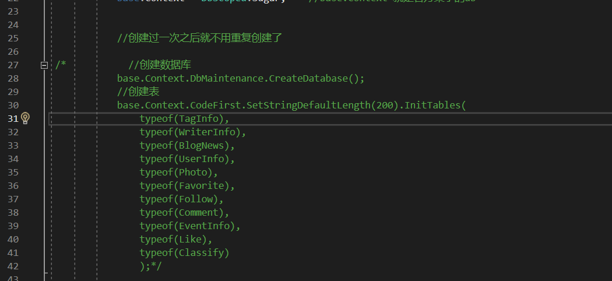

# MyBlog

一个个人博客网站，用于学习ASP.NET Core等现关技术的练手项目

 

技术栈：

后端：

ASP.NET Core

[SqlSugar ORM](https://www.donet5.com/Doc/99999999999/1180)

前端：

[Layui ](https://layui.dev/)

[Bootstrap](https://www.bootcss.com/)

[jQuery](https://jquery.com/)

[Razor](https://learn.microsoft.com/zh-cn/aspnet/web-pages/overview/getting-started/introducing-razor-syntax-c)

## 基本功能

* 用户鉴权注册登录

* 实现博客的浏览，发表，收藏，点赞，评论等基本功能

* 关注，粉丝基本功能

* 足迹功能

* 通过视频来生成一篇博客（测试阶段，并不稳定）

* 后端管理系统（对博客中所有内容的增删改查）

  

例图：

## 运行说明

- git  Clone  项目地址  到本地
- 用VS打开项目
- 第一次运行的时候将BaseRepository中的如下注释符号去除即可自动创建相应的表，之后运行再将这段代码注释（否则每次表操作都会很慢）。数据库是通过Sqlsugar的CodeFirst来生成的，所以**不需要手动输入表到SqlServer**，第一次运行的时候将BaseRepository中的如下注释符号去除即可自动创建相应的表，之后运行再将这段代码注释（否则每次表操作都会很慢）。

- 运行项目即可

## 数据库

本项目的数据库使用的是SqlServer，使用以及配置过程可以见源码，要是未来有空的话可以整理一下，SqlSugar是 类似EF的存在  ，就是一个ORM。

### 数据库设计

见  **MyBlog.Model**

TODO：

* 音乐播放
* 视频嵌入博客
* 社区功能丰富

